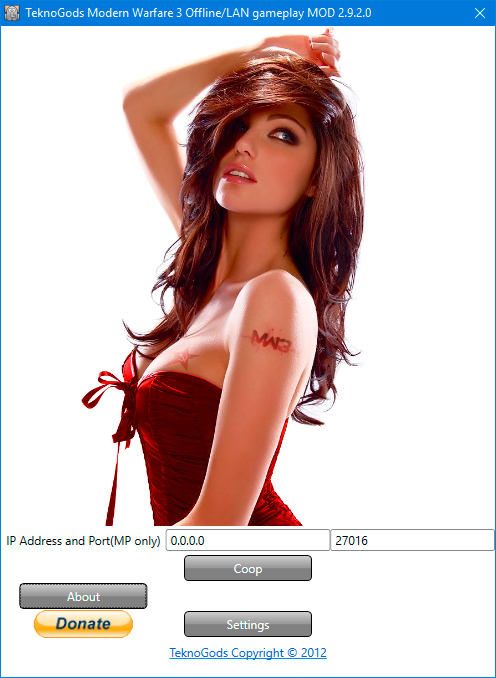
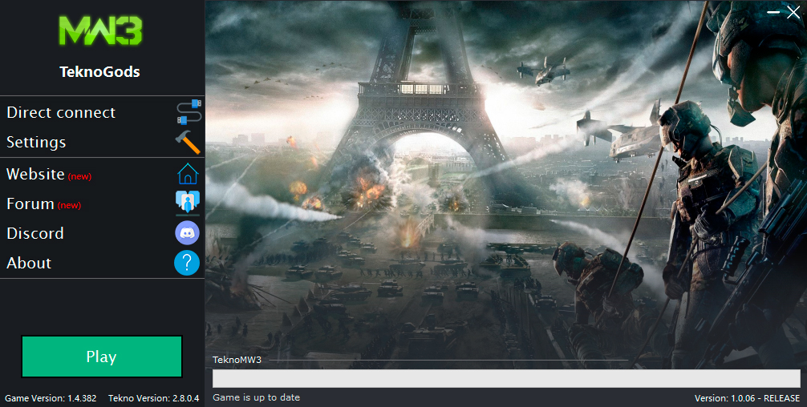
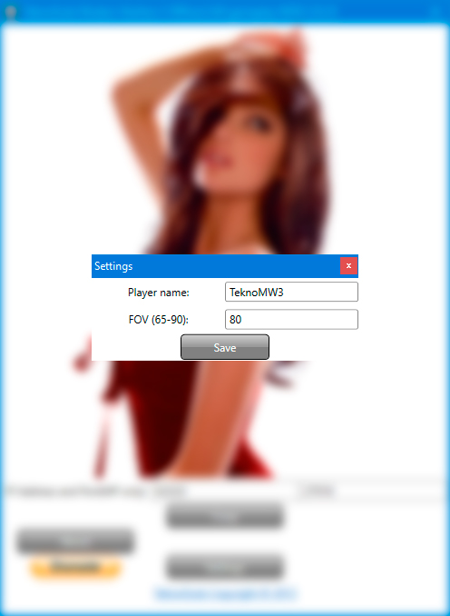
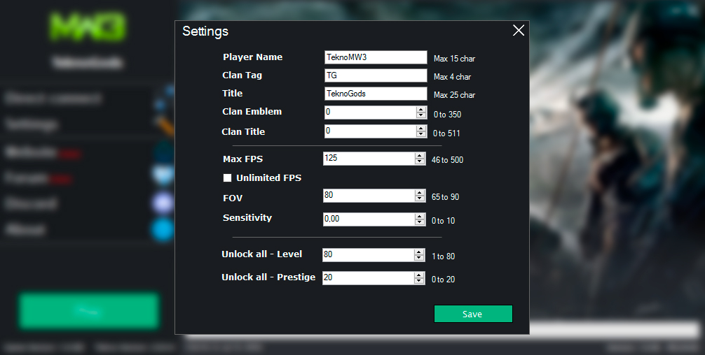
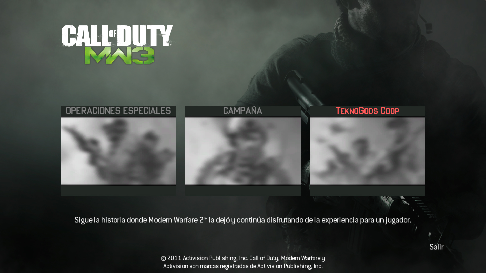
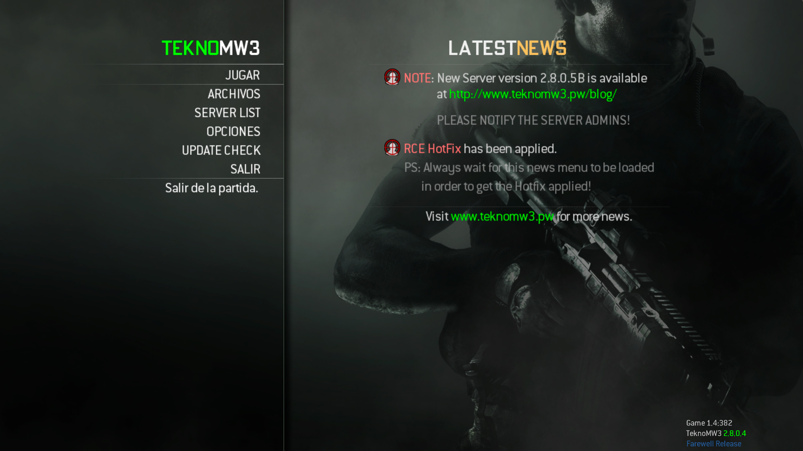
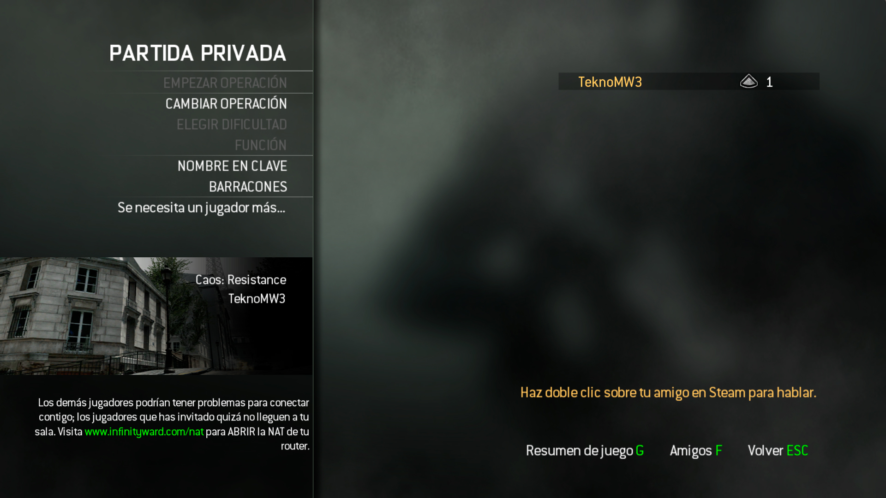
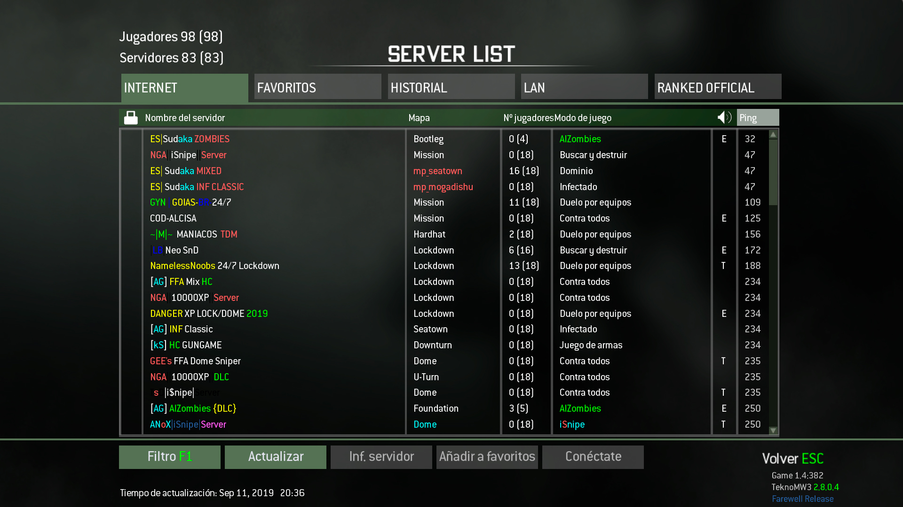
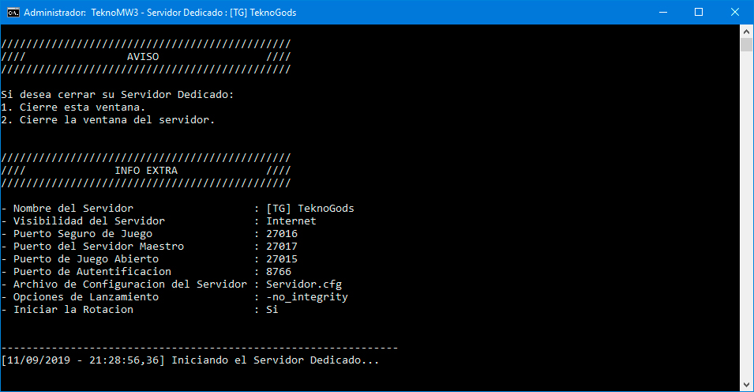
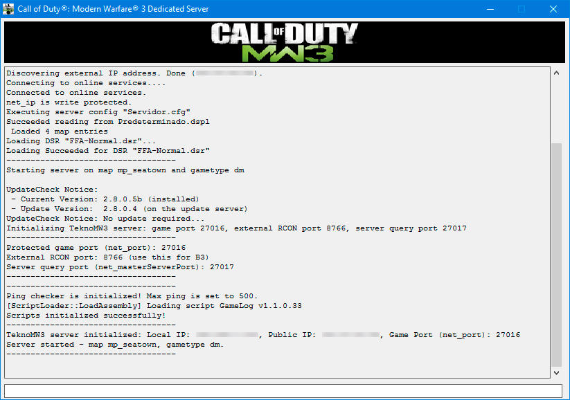

# TeknoGods (TeknoMW3)
  -blue?style=flat-square&logo=atom&logoColor=fff&labelColor=000)
- **TeknoMW3** es el proyecto de **TeknoGods** para poder jugar al **Call of Duty: Modern Warfare 3** (con el nombre en clave (oficial) de **IW5**).
  - También cuenta con otros proyectos, dado que TeknoGods es un equipo de programadores a los que les gusta trabajar en varios proyectos de modificación extrema (como TeknoParrot).
- Cuenta con las siguientes **características principales**:
  - Servidores Dedicados [MP]
  - Soporte para InfinityScript [MP]
  - Lo mejor para una LAN [SO y MP]
  - Estabilidad y aumento del rendimiento en el cliente y servidor
  - Alta modificación de servidor
  - Fácil de instalar

## Aviso
- Es preferible que busques información y todo en el [Foro de TeknoMW3](#enlaces-de-teknomw3), dado que ahí es donde estará realmente actualizado todo.
- Este repositorio no contiene ningún código de TeknoMW3, tan solo proporciona soporte y ayuda a los usuarios de habla hispana.
- Este repositorio se basa en el de [Musta](https://github.com/Musta1337/TeknoMW3).
  - La diferencia es que el mio esta en Español, puede estar desactualizado (si él agrega algo, no lo tendré yo aquí al instante) e incluso puede contener cosas extras (o que falten).
    - Si necesitas ir al repositorio de Musta, pero no sabes Inglés, puedes usar [DeepL](https://www.deepl.com/translator) como Traductor de Inglés a Español.
- **TeknoGods** (y por lo tanto, TeknoMW3) no apoya la piratería, esto significa que no podrán darte archivos del juego base (como los DLC, la Update 1.4.382 o 1.9.446, etc.).

## Tabla de Contenidos
- [Cliente](../../wiki/Cliente)
- [Servidor](../../wiki/Servidor)
- [Preguntas Frecuentes](../../wiki/Preguntas-Frecuentes)
- [Solución de problemas](../../wiki/Soluci%C3%B3n-de-problemas)
- [Optimizar TeknoMW3](../../wiki/Optimizar-TeknoMW3)
- [[B3] Big Brother Bot](https://github.com/Musta1337/TeknoMW3/wiki/Big-Brother-Bot-Setup)
- [Update 1.4.382](../../wiki/Update-1.4.382)
- [TeknoMW3 2.92](../../wiki/TekonMW3-2.92)
- [Enlaces de TeknoMW3](#enlaces-de-teknomw3)
- [Enlaces importantes de CoD: MW 3](#enlaces-importantes-de-cod-mw-3)
- [Imágenes](#imágenes)

## Enlaces de TeknoMW3
**[`^        VOLVER ARRIBA        ^`](#tabla-de-contenidos)**
- [Sitio Web](https://www.teknomw3.pw/) - Sitio web oficial de TeknoMW3.
- [Blog](https://www.teknomw3.pw/blog/) - Blog oficial de TeknoMW3, donde se pondrán anuncios importantes sobre el proyecto.
- [Foro](https://forum.teknomw3.pw/) - Foro oficial de TeknoMW3, donde encontrarás todas las guías y demás sobre el proyecto.
- [Discord](https://discord.gg/7Wxn85M) - Servidor oficial de TeknoMW3, es mejor que pidas soporte aquí y demás cosas sobre el proyecto.

## Enlaces importantes de CoD: MW 3
**[`^        VOLVER ARRIBA        ^`](#tabla-de-contenidos)**
- [Manual](https://store.steampowered.com/manual/115300/)
- [Discusiones](https://steamcommunity.com/app/42680/discussions/) ([MP](https://steamcommunity.com/app/42690/discussions/))
- [Guías](https://steamcommunity.com/app/42680/guides/) ([MP](https://steamcommunity.com/app/42690/guides/))
- [PCGamingWiki](https://pcgamingwiki.com/wiki/Call_of_Duty:_Modern_Warfare_3)

## Imágenes
**[`^        VOLVER ARRIBA        ^`](#tabla-de-contenidos)**

| **Campaña** / **Operaciones Especiales** (**SP** / **SO**) TeknoMW3 2.92 | **Modo Multijugador** (**MP**) TeknoMW3 2.8.0.4 |
|:----:|:----:|
| 
 | 
 |
| 
 | 
 |
| 
 | 
 |
| 
 | 
 |
| **Servidor Dedicado (MP)** | **Servidor Dedicado (MP)** | 
| 
 | 
 |
